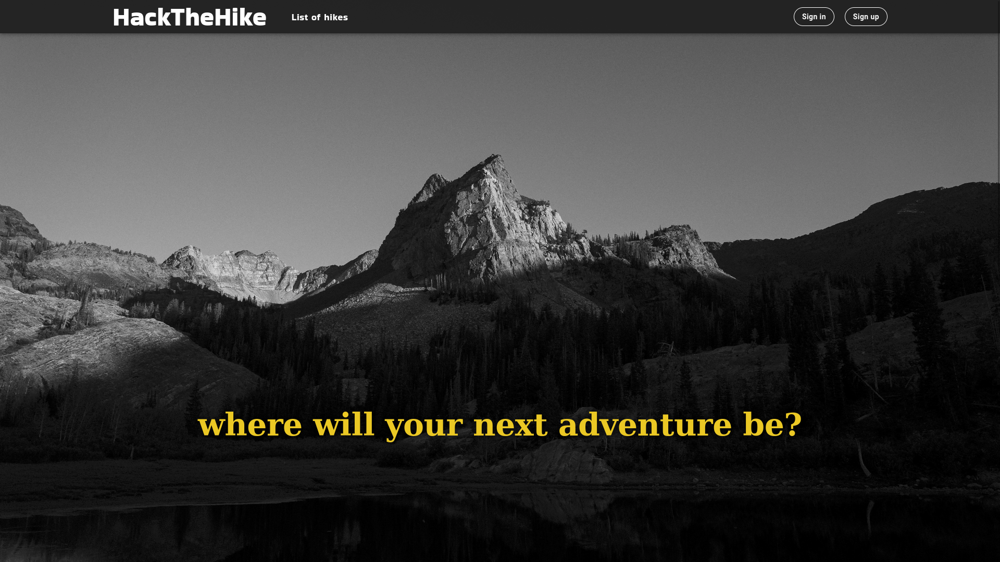

# HackTheHike

## Team
### s292447 Sagristano Vincenzo
### s297925 Battipaglia Antonio
### s300744 Gorodnev German
### s303968 Zurru Laura
### s296962 Grande Francesco
### s301290 Gholami Erfan

## React Client Application Routes

- Route `/`: main page in which, based on whether the user is logged in or not, there will be shown welcoming contents like suggested hikes or some information about the website.
- Route `/listofhikes`: there is a page divided in two parts: a list of hikes (represented by means of cards) and a proper filter box.
- Route `/listofhuts`: there is a page divided in two parts: a list of huts (represented by means of cards) and a proper filter box.
- Route `/browsehikes`: there is a map containing all the markers for each hike. After clicking on a marker, an info box is displayed and clicking on its buttons it's possible to see more information about the hike or see its path on the map.
- Route `/login`: in this page the user can log in by means of their credentials.
- Route `/signup`: in this page, it's possible to sign up as a hiker, a local guide or a hut worker. An email is sent and, after having clicked on the link in the email, the administrator will be in charge of accepting either new local guides and new hut workers.
- Route `/newHut`: here it's possible to create a new hut following a three-step procedure and selecting the location point on the map.
- Route `/myHuts`: lists all the hut in which an hut worker works.
- Route `/myHikes`: lists all the hikes created by a local guide.
- Route `/showhike/:hikeid`: this page contains all the information about a single hike.
- Route `/showhut/:hutid`: this page contains all the information about a single hut.
- Route `/newParking`: here it's possible to create a new parking lot following a three-step procedure and selecting the location point on the map.
- Route `/edithike/:hikeid`: in this page the local guide can edit all the information about their hike.
- Route `/newHike`: here the user can create a new hike, filling the form with all the information related to the hike and uploading a GPX file containing all the points of the path.
- Route `/hikerdashboard`: in this dashboard the hiker is able to set all their preferences such that the website will propose them the hikes that best fits their needings and tastes.
- Route `/admindashboard`: in this dashboard the admin is able to accept the incoming requestes in order to complete the registration of local guides and hut workers.
- Route `/hutWorkerHuts`: lists all the hut owned by the logged hut worker.
- Route `/edithut/:hutid`: in this page the hut worker can edit all the information about their hut.
- Route `/hutWorkerHuts/linkedHikes`: in this page there is a list of all the hikes linked to a certain hut in which the hut worker can edit all the conditions for each hike.

## API Server

- GET `/hikes`
  - Request: empty
  - Response: list of hikes
- POST `/hikes/filteredHikes`
  - Request: an object containing the filter
  - Response: filtered list of hikes
- GET `/hikes/:hikeID`
  - Request: empty
  - Response: an object containing all the information about a single hike
- GET `/me/hikes`
  - Request: empty
  - Response: list of hikes inserted by a local guide identified by their auth token
- GET `/:path`
  - Request: empty
  - Response: the gpxFile corresponding to the path indicated by the path parameter
- POST `/huts/filter`
  - Request: filter
  - Response: filtered list of huts
- GET `/huts/:hutID`
  - Request: empty
  - Response: an object containing all the information about a single hut
- GET `/huts/mine`
  - Request: empty
  - Response: list of huts owned by the user based on the auth token 
- POST `/hike-modification/hutsAndParkingLots`
  - Request: radius
  - Response: a list containing all the huts and the parking lots contained in the circumference
- POST `/auth/login`
  - Request: credentials
  - Response: an object containing all the user information
- GET `/auth/register`
  - Request: credentials
  - Response: an object containing all the user information
- POST `/huts/createHut`
  - Request: an object containing all the information about the hut inserted by the user
  - Response: the hut object returned from the backend
- POST `/parkingLot/insertLot`
  - Request: an object containing all the information about the parking lot inserted by the user
  - Response: the parking lot object returned from the backend
- POST `/hikes/import`
  - Request: a formdata object containing the gpx file to be uploaded
  - Response: an object containing the track associated to the gpx file
- PUT `/hikes/:hikeID`
  - Request: an object containing the hike information
  - Response: the information about whether the insertion has been completed successfully or not
- GET `/auth/not_approved/local_guides`
  - Request: empty
  - Response: the list of not approved local guides
- GET `/auth/not_approved/hut_workers`
  - Request: empty
  - Response: the list of not approved hut workers
- PUT `/auth/approve_user`
  - Request: the id of the user to be approved
  - Response: the information about whether the insertion has been completed successfully or not
- GET `/me/preferences`
  - Request: empty
  - Response: list of preferences associated to the user by their auth token
- POST `/me/set_preferences`
  - Request: an object containing all the preferences
  - Response: the information about whether the insertion has been completed successfully or not
- DELETE `/hikes/:hikeID`
  - Request: the ID of an hike
  - Response: a list containing all the rows affected by the deletion of the hike idetified by the hikeID in the request
- GET `/huts/hutWorker/iWorkAt`
  - Request: empty
  - Response: list of all the huts in which the hut worker works
- PUT `/hut/updateDescription/:hutID`
  - Request: an object containing all the information about a hut to be updated
  - Response: an object containing all the updated information abuot the hut specified by the hutID
- PUT `/hikes/:hikeID`
  - Request: an object containing all the indormation about a hike in order to edit start and ending point
  - Response: an object containing the updated information about the hike identified by the hikeID
- POST `/hikes/linkPoints`
  - Request: an object containing the hikeID and a list containing all the linked points
  - Response: an object containing all the hike details
- GET `/hikes/hutWorkerHikes`
  - Request: empty
  - Response: list of all the updatable hikes based on the auth token of the logged user
- PUT `/hikes/condition`
  - Request: an object containing all the information about hikes conditions
  - Response: an object containing the updated hike
- POST `/hut-pictures`
  - Request: an object containing the array of pictures to be added to the hut
  - Response: the information about whether the insertion has been completed successfully or not
- POST `/hut-pictures/:hutID/modify`
  - Request: a list of strings containing the pathname of the images associated to the hut corresponding to the one identified by the hutID
  - Response: the information about whether the insertion has been completed successfully or not

## Database Tables

- Table `hikes` - hike info is stored here
- Table `hike_points` - table connecting points to hikes
- Table `hut-worker` - table connecting huts to users (workers)
- Table `huts` - huts info
- Table `parking_lots` - parking lots info
- Table `points` - all geo coordinates are here, plain lat/lon/addresses, hut positions, parking lot positions, start/end points
- Table `user_hike_track_points` - points tracked by users during hiking 
- Table `user_hikes` - all hikes performed by users
- Table `users` - users info

## Screenshot

## Users Credentials

- username, password (plus any other requested info)
- vivi@polito.it, myself - List of surveys: Pokémon: how much do you know about it?, Summer days: pick up your destination!, Favorite color, What kind of vegetable are you?
- fulvio.corno@polito.it, fulviocorno - List of surveys: CPD: Web Application I, Next lecture day
- andy@friends.com, friends - List of surveys: Scotland: a great country!
- sibilla@gmail.com, sissisissi - List of surveys: empty
- guest@guest.com, guestguest - List of surveys: empty
