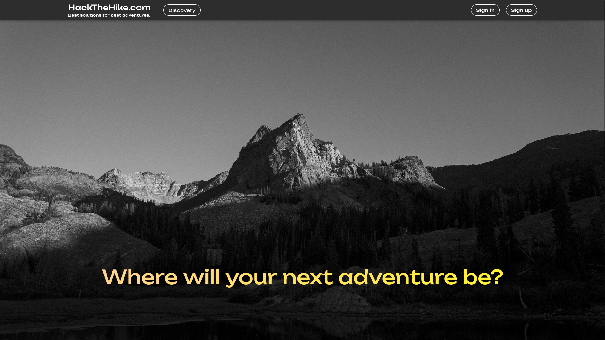

# HackTheHike
Application for promoting hiking activities in the mountains, fostering group activities through collaborative track of hikes, leveraging the network of mountain huts, ease safety operations in case of incidents/emergencies.

## Team
### s292447 Sagristano Vincenzo
### s297925 Battipaglia Antonio
### s300744 Gorodnev German
### s303968 Zurru Laura
### s296962 Grande Francesco
### s301290 Gholami Erfan
## Table of Contents

- [Install](#install)
- [Usage](#usage)
    - [Docker](#docker)
    - [Local](#local)
- [Database Table](#database-tables)
- [User Credentials](#user-credentials)

## Install

Use following command to download the project:
```sh
$ git clone git@github.com:polito-SE2-TEAM-20/softeng2-Hike-Tracker.git
```

## Usage
There are two ways for running our project: locally or using Docker images.

#### Docker

At this link you can find the Docker images for running HackTheHike:
[https://hub.docker.com/r/germangorodnev/se2-team20](https://hub.docker.com/r/germangorodnev/se2-team20)

#### Local

Requirements:
- `nodejs`
- `npm` 

Execute the following commands to start using HackTheHike locally (the install commands will require some minutes):

```sh
$ cd server
$ npm install
$ npm start
$ cd client
$ npm install
$ npm start
```

## Screenshot



## User Credentials

- Email: provaMary@gmail.com, Password: qwertyMary (LOCAL GUIDE)
- Email: provaMark@gmail.com, Password: qwertyMark (LOCAL GUIDE)
- Email: provaMike@gmail.com, Password: qwertyMike (LOCAL GUIDE)
- Email: vepapav822@cosaxu.com, Password: qwerty  (LOCAL GUIDE)
- Email: cicicoco.1234@libero.it, Password: qwertyAndrea (HUT WORKER)
- Email: xesica8246@covbase.com, Password: qwerty (HUT WORKER)
- Email: docorix637@cnogs.com, Password: qwerty (HUT WORKER)
- Email: provaAdam@gmail.com, Password: qwertyAdam (HIKER )
- Email: provaPeter, Password: qwertyPeter (HIKER)
- Email: premierensp@gmail.com, Password: qwerty (PLATFORM MANAGER)